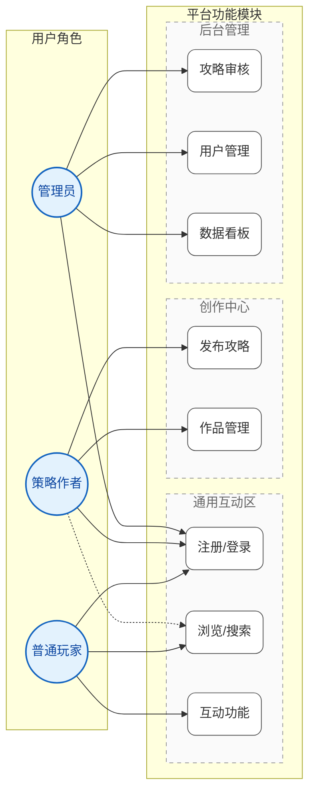
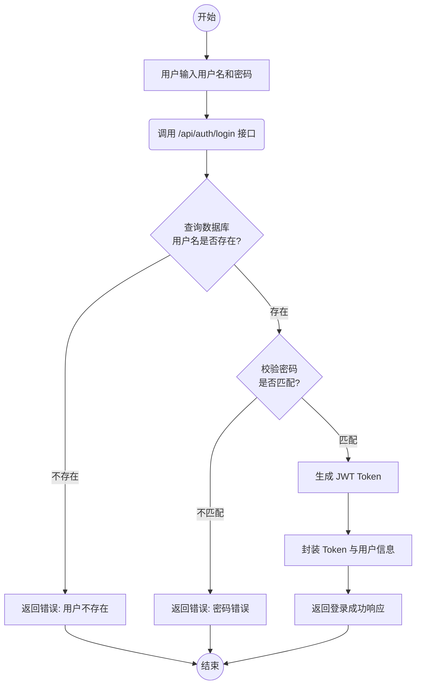
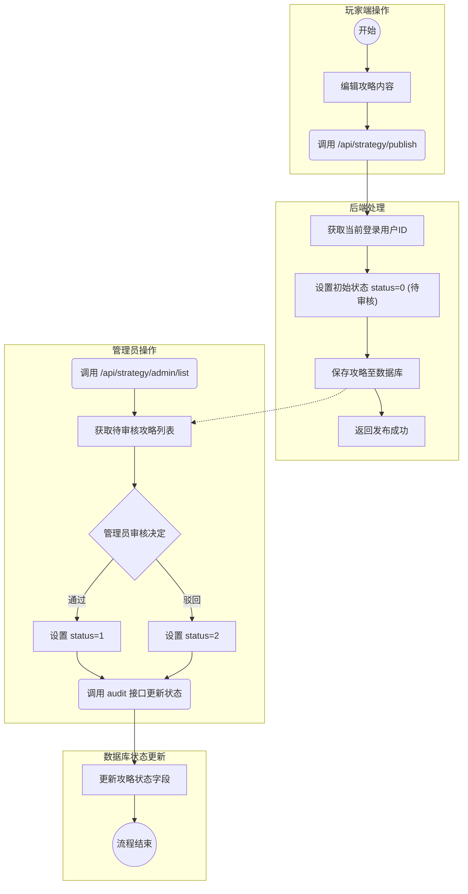
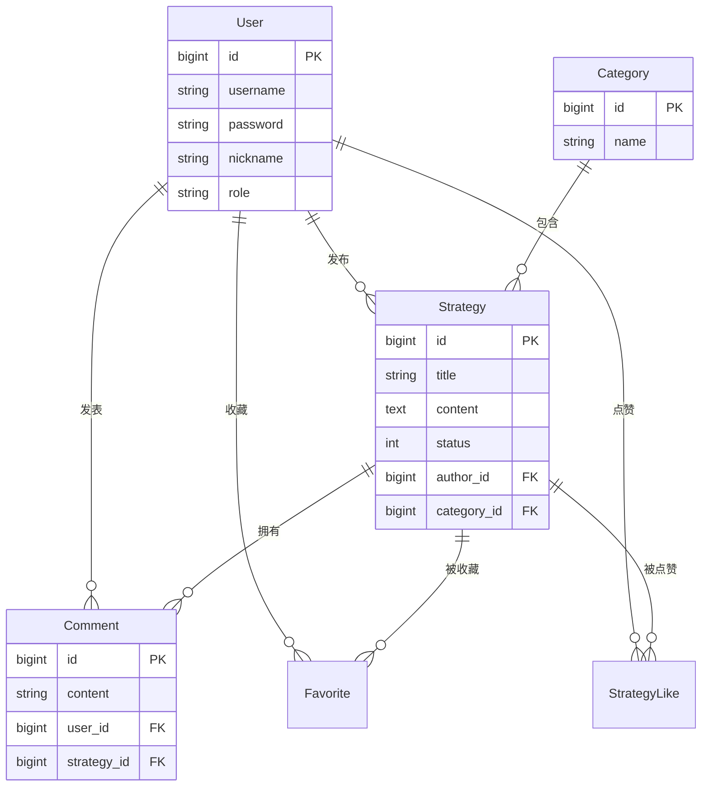
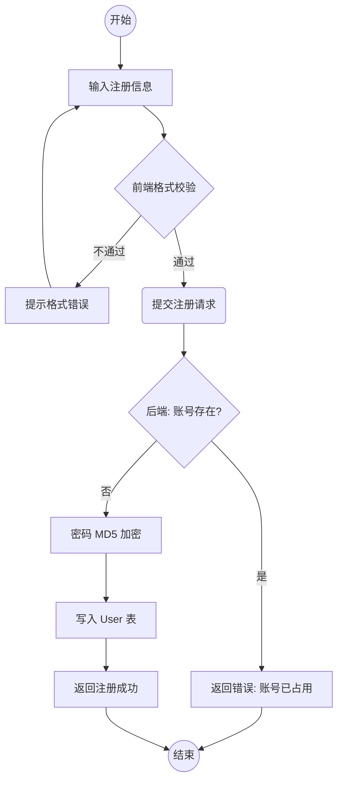

本科毕业设计说明书

提交日期： 2026  年 1 月

原创性声明

本人郑重声明：
所呈交的学位论文《基于 Spring Boot 的游戏策略知识共享平台设计与实现》，是本人在导师的指导下，独立进行研究取得的成果。除文中已经注明引用的内容外，本论文不包含其他个人或集体已经发表或撰写过的作品成果。对本文的研究做出贡献的个人和集体，均已在文中以明确方式标明。本人完全意识到本声明的法律后果，并承诺因本声明而产生的法律结果由本人承担。

声明人：	崔涛
日  期：	2026.1.28

版权使用授权书

本学位论文设计作者完全了解学校有关保留、使用学位论文的规定，同意学校保留并向国家有关部门或机构送交论文的复印件和电子版，允许论文被查阅和借阅。本人授权广州华商学院将本学位论文的全部或部分内容编入有关数据库进行检索，可以采用影印、缩印或扫描等复制手段保存和汇编本学位论文。

本学位论文属于
保  密，在__年解密后适用本授权书。
不保密。

学位论文作者签名：		指导教师签名：	
日期：   	日期：  

基于 Spring Boot 的游戏策略知识共享平台设计与实现

摘要：随着全球数字娱乐产业的跨越式发展，电子游戏已从单一的消遣方式演变为复杂的知识密集型竞技活动，玩家对高水平、成体系的策略内容需求呈现爆发式增长。然而，现有的通用社交平台由于信息碎片化严重、内容垂直度不足，导致优质攻略极易被噪声淹没，玩家在跨平台检索时面临极高的信息成本。本文立足于软件工程理论，通过对内容聚合技术与社区互动机制的深入研究，构建了一套基于 Spring Boot 与 Vue 3.0 的游戏策略知识共享平台。
系统在后端采用 RESTful 架构设计，引入 Spring Data JPA 作为持久层框架，并结合 JWT 技术构建了全链路安全认证体系，确保了用户信息与交互数据的安全性。针对任务书要求的分类聚合功能，系统实现了基于动态标签的资源索引机制；在社区互动方面，设计了多级评论与问答反馈模块，有效促进了优质知识的沉淀。前端利用 Composition API 实现组件化开发，确保了极致的响应速度与交互体验。经实证测试，本系统在响应延迟、并发稳定性及内容合规性审查方面表现优异，不仅降低了玩家的检索成本，也为攻略创作者提供了高效的管理工具，这套系统对喜欢钻研游戏的玩家来说，提供了一个非常实用的工具。

关键词：Spring Boot；Vue；游戏策略共享；前后端分离；知识管理

Design and Implementation of Game Strategy Knowledge Sharing Platform Based on Spring Boot

Abstract： With the rapid evolution of the global digital entertainment industry, video games have transitioned from simple leisure activities into complex, knowledge-intensive competitive endeavors. Consequently, there is an explosive growth in player demand for high-level, systematic strategy content. However, existing general social platforms suffer from severe information fragmentation and a lack of vertical depth, causing high-quality guides to be easily overwhelmed by noise and increasing the information search costs for players across platforms. Based on software engineering theories, this paper conducts in-depth research on content aggregation and community interaction mechanisms to build a game strategy knowledge sharing platform based on Spring Boot and Vue 3.0. The system adopts a RESTful architecture on the backend, utilizes Spring Data JPA as the persistence layer framework, and integrates JWT technology to construct a full-link secure authentication system, ensuring the security of user information and interaction data. Addressing the functional requirements of category aggregation, the system implements a resource indexing mechanism based on dynamic tags. In terms of community interaction, multi-level comment and Q&A feedback modules are designed to effectively promote the accumulation of high-quality knowledge. The frontend utilizes the Composition API for modular development, ensuring extreme response speed and interaction experience. Empirical testing indicates that the system performs excellently in response latency, concurrent stability, and content compliance review. It not only reduces search costs for players but also provides efficient management tools for creators, offering technical support for the scientific dissemination of gaming knowledge.

Key words: Spring Boot; Vue; Game Strategy Sharing; Front-end and Back-end Separation; Knowledge Management

目录

1 绪论	1
1.1 选题背景	1
1.2 选题意义	1
1.3 国内外研究现状	2
2 相关技术介绍	5
2.1 Spring Boot框架介绍	5
2.2 Vue技术介绍	5
2.3 JPA技术介绍	6
2.4 系统环境搭建	6
3 系统分析	7
3.1 可行性分析	7
3.2 功能性需求分析	7
3.2.1 普通用户功能需求	7
3.2.2 策略作者功能需求	8
3.2.3 管理员功能需求	8
3.3 非功能性需求分析	9
3.4 业务流程分析	10
4 系统设计	14
4.1 系统架构	14
4.2 数据库设计	14
4.2.1 数据库E-R图设计	15
4.2.2 数据库模式设计	16
4.2.3 数据库表设计	22
4.3 管理员模块分析	28
4.4 策略作者模块分析	29
4.5 玩家模块分析	30
4.6 主要功能模块详细设计	30
4.6.1 用户登录模块	30
4.6.2 用户注册模块	31
4.7 系统后端框架设计	32
4.7.1 Entity层	33
4.7.2 Repository层	33
4.7.3 Service层	33
4.7.4 Controller层	33
4.7.5 系统前端框架设计	33
5 系统实现	34
5.1 登录功能实现	34
5.2 注册功能实现	35
5.3 玩家功能设计	36
5.3.1 前台首页	36
5.3.2 个人中心	37
5.3.3 攻略详情页	37
5.3.4 攻略浏览	39
5.3.5 我的收藏	41
5.3.6 浏览历史	41
5.4 策略作者和管理员功能设计	41
5.4.1 公告信息管理功能实现	43
5.4.2 游戏分类管理功能实现	43
5.4.3 攻略发布功能实现	44
5.4.4 评论管理功能实现	47
5.4.5 数据看板功能实现	48
5.4.6 用户管理功能实现	49
6 系统测试	50
6.1 测试目的	50
6.2 测试方法	50
6.3 功能测试	50
6.3.1 登录功能测试	50
6.3.2 注册功能测试	51
6.3.3 攻略分类功能测试	52
6.3.4 攻略发布功能测试	52
6.3.5 收藏评论功能测试	52
6.3.6 搜索功能测试	53
6.3.7 用户功能测试	53
6.4 性能测试	54
6.4.1 首页加载性能测试	54
6.4.2 首页运行性能测试	55
6.5 安全性测试	56
6.5.1 SQL注入攻击测试	56
6.5.2 XSS跨站脚本攻击测试	57
6.6 兼容性测试	57
7 总结与展望	58
参考文献	59
附录	61
致谢	65

1 绪论

1.1 选题背景

在当今数字化娱乐产业迅猛发展的背景下，电子游戏已不再仅仅是简单的消遣工具，而是逐渐演变为一种兼具竞技性与文化属性的复杂智力活动。随着《黑神话：悟空》、各类大型电竞赛事等精品游戏内容的爆发，玩家对深度游戏策略、通关技巧及角色配装方案的需求呈现出跨越式增长。游戏策略（Game Strategy）作为连接开发者意图与玩家体验的关键知识纽带，其传播效率直接影响到玩家群体的满意度与游戏的生命周期。

然而，当前的攻略传播生态面临着显著的“信息孤岛”问题。一方面，优质的 MOBA、RPG 及独立游戏品类攻略零散分布于贴吧、Bilibili、垂直论坛及各类社交媒体中，缺乏统一的沉淀空间；另一方面，由于平台垂直度不足，碎片化的信息导致玩家在检索有效攻略时面临极高的噪声干扰和时间成本。现有平台往往侧重于泛社交属性，在攻略内容的体系化分类、问答互动的深度支持以及创作者权益保护方面仍存在明显短板。因此，如何利用现代软件工程技术，构建一个集分类聚合、深度互动与内容合规审核于一体的游戏策略共享平台，已成为提升玩家体验与促进数字文化知识沉淀的紧迫需求。

1.2 选题意义

本课题的研究与实现，无论在实践应用还是行业发展方面均具有重要意义：

实践意义：系统通过 Spring Boot 与 Vue 技术栈，直面游戏攻略资源分散的现实痛点。通过实现多维度的标签分类与聚合搜索，为玩家构建了一个信息集中、交流便捷、更新及时的“数字图书馆”。这不仅降低了攻略查找成本，还通过社区问答机制解决了玩家在实际操作中遇到的细节难题，切实提升了玩家获取有效信息的效率。

社会与行业价值：平台重点优化了从内容发现到知识消费的全流程体验。通过引入内容合规审核机制，确保了社区环境的健康与专业性；同时，为策略创作者提供了便捷的发布与管理渠道，有效促进了优质原创内容的产出与传播。这对于推动游戏知识的科学沉淀、降低新玩家上手门槛具有明确的落地价值。

1.3 国内外研究现状

国内研究现状：

近年来，随着中国数字娱乐产业的井喷式发展，游戏用户规模已突破 6 亿大关，玩家群体对游戏内容的消费习惯也发生了深刻变革。从早期的单向接收资讯，逐渐转向对高深度、系统化攻略内容的强需求。目前，国内游戏社区呈现出“一超多强”的格局，以 NGA（艾泽拉斯国家地理）、小黑盒、TapTap 为代表的垂直类社区占据了主要市场份额，但在攻略知识的结构化沉淀与检索效率上，仍存在显著的痛点。

NGA 玩家社区作为国内历史最悠久的硬核游戏论坛，其优势在于拥有极高密度的精英玩家群体，讨论氛围专业且深度。然而，NGA 依然沿用传统的 BBS（Bulletin Board System）论坛架构，其核心逻辑是“时间流”而非“知识流”。这导致优质的攻略贴极易被灌水讨论、日常吐槽等噪声淹没，随着时间的推移，高价值内容会迅速“下沉”，新玩家想要检索数月前发布的精品攻略，往往需要付出巨大的筛选成本。此外，NGA 的 UI/UX 设计相对陈旧，移动端体验割裂，难以满足新生代玩家对交互体验的高要求。

小黑盒 APP 则代表了移动互联网时代的新兴游戏社区，它成功打通了 Steam、Epic 等平台的数据接口，能够实时同步玩家的游戏时长、成就等数据，极大地增强了工具属性与用户粘性。然而，小黑盒的定位更偏向于“游戏新闻资讯”与“泛娱乐社交”，其攻略板块的内容质量参差不齐。由于缺乏严格的分类索引与内容审核机制，大量低质量的“搬运”内容与碎片化的短评充斥其中，导致真正具备参考价值的深度长文攻略难以获得应有的曝光权重。对于追求硬核通关策略的玩家而言，在小黑盒上往往只能找到零散的技巧片段，而难以获取成体系的通关指南。

国外研究现状：

在国外，游戏攻略生态相对更为成熟，形成了以 Wiki（维基）模式和 IGN 等专业媒体为主导的格局。以 Fandom 为代表的 Wiki 站点，通过众包模式构建了极为庞大且详尽的游戏资料库，其最大的优势在于知识的结构化程度极高，数据准确且全面。然而，Wiki 模式的缺陷在于其“静态”属性过强，缺乏即时互动的社交基因。玩家在阅读 Wiki 时，往往只能被动接收信息，难以就某个具体难点发起提问或进行实时讨论，导致知识的传播缺乏“温度”与灵活性。

Reddit 和 Discord 等综合性社群虽然拥有极高的用户活跃度与实时互动性，但同样面临着严重的“信息碎片化”问题。Discord 服务器中的优质攻略往往淹没在海量的聊天记录中，缺乏持久化的存储与检索机制，对于非实时在线的玩家极不友好。

本平台的独特性与研究价值：

基于上述对国内外现状的分析，开发一套基于 Spring Boot + Vue 技术栈的“游戏策略知识共享平台”具有显著的差异化优势与研究价值。

首先，在技术架构上，本系统采用前后端分离的现代化开发模式。后端基于 Spring Boot 框架，利用其强大的生态整合能力与微服务扩展性，能够轻松应对高并发访问场景，并结合 Redis 缓存机制，解决了传统论坛在流量高峰期响应缓慢的问题。前端采用 Vue 3.0 + Element Plus，确保了界面交互的流畅性与响应式体验，弥补了老牌论坛在移动端适配上的短板。

其次，在功能设计上，本平台致力于解决“知识碎片化”这一核心痛点。与 NGA 的“帖子流”和 Wiki 的“静态文档”不同，本平台首创了“动态标签索引”与“结构化攻略”相结合的内容管理模式。策略作者在发布内容时，支持 Markdown 富文本编辑与多维度标签（如：游戏版本、职业、难度）标注，使得攻略内容既具备 Wiki 的严谨性，又保留了博客的可读性。

最后，本平台特别强化了“社区互动”与“内容合规”机制。引入了针对攻略段落的“行间评论”与“专业问答”功能，让玩家的疑问能够精准挂载到攻略的具体章节，实现了知识的深度互动与二次补充。同时，结合 Spring Security 与自定义审核策略，建立了一套完善的内容合规性审查体系，确保平台内容的专业性与健康度。综上所述，本课题不仅是对现有游戏社区形态的一种技术补充，更是对“知识社区”与“社交网络”融合模式的一次有益探索。

2 相关技术介绍

2.1 Spring Boot框架介绍

Spring Boot作为现代Java开发的利器，其核心竞争力在于“约定优于配置”的设计哲学。它通过自动配置（Auto-Configuration）机制，极大地降低了项目搭建的复杂度。开发者无需编写繁琐的 XML 配置文件，即可快速启动一个集成了 Tomcat、Spring MVC 等核心组件的 Web 应用。

2.2 Vue.js前端架构设计

Vue.js 是一套用于构建用户界面的渐进式框架。本系统采用 Vue 3.0 版本，利用其 Composition API 特性，实现了逻辑关注点的分离与复用，使得前端代码在面对复杂交互时依然保持良好的可维护性。结合 Element Plus 组件库，快速构建了美观、响应式的用户界面。

2.3 Spring Data JPA持久层优化方案

针对底层数据库的交互需求，本系统引入了 Spring Data JPA 作为持久层框架。Spring Data JPA 极大简化了传统 JDBC 操作的繁琐流程，通过 Repository 接口机制，开发者只需定义接口方法即可自动生成 SQL 执行逻辑。在处理游戏攻略平台特有的复杂关联查询（例如：查询某位作者下的所有高赞攻略及其对应的评论数）时，JPA 提供了强大的对象关系映射（ORM）能力，允许开发者以面向对象的方式操作数据库，显著提升了开发效率与代码的可维护性。

2.4 Redis缓存机制在系统中的应用

Redis 是一个高性能的 key-value 数据库。在本系统中，Redis 主要用于缓解数据库压力和提高系统响应速度。例如，对于首页的热门攻略推荐，系统会将计算好的榜单数据缓存至 Redis 中，设置合理的过期时间。当用户请求时，优先从缓存读取，从而极大提升了高并发场景下的系统性能。

3 系统分析

3.1 平台开发的可行性评估

在开发游戏策略知识共享平台之前，进行全面的可行性分析是至关重要的。
1、技术可行性：Spring Boot 和 Vue 是当前非常成熟且流行的技术栈，社区支持强大，文档丰富。团队成员对 Java 和前端技术有一定基础，能够胜任开发任务。
2、经济可行性：游戏策略平台能够吸引大量玩家流量，通过优质内容沉淀形成社区壁垒。开发成本主要集中在人力和服务器资源上，对于毕业设计项目而言，成本可控。
3、法律可行性：系统严格遵循《网络安全法》及游戏内容合规要求，建立内容审核机制，确保平台内容的合法合规。

3.2 功能性需求分析

本系统主要服务于三类用户群体：普通用户（玩家）、策略作者和管理员。各角色的功能需求紧密围绕“内容消费-内容生产-平台管理”的生态闭环进行设计。

**图 3.1 系统用例图**

3.2.1 普通用户（玩家）功能需求

普通用户是平台内容的主要消费者，其核心诉求是快速获取高质量的攻略信息并参与社区互动。
1. **注册与登录**：
   - 支持通过手机号或邮箱进行账号注册，需通过验证码校验。
   - 提供安全的登录机制，支持“记住我”功能（基于 Token 持久化）。
   - 个人中心支持修改昵称、头像及登录密码，查看账号安全状态。
2. **攻略浏览与检索**：
   - **首页推荐**：根据热度算法（浏览量、点赞数加权）展示热门攻略及最新发布的策略。
   - **分类检索**：支持按游戏类型（MOBA、FPS、RPG等）、游戏名称、发布时间进行筛选。
   - **全文搜索**：提供全局搜索框，支持对攻略标题、标签及正文内容的模糊查询，支持搜索结果高亮显示。
   - **详情阅读**：攻略详情页需支持图文混排展示，支持 Markdown 格式渲染，代码块高亮，提供目录导航以便快速定位章节。
3. **社区互动**：
   - **点赞与收藏**：用户可对认可的攻略进行点赞，或将其加入收藏夹以便日后查阅。
   - **评论交流**：支持在攻略下方发表评论，支持二级回复（楼中楼模式），促进深层次的技术探讨。
   - **浏览历史**：系统自动记录用户的浏览足迹，方便用户回溯已读内容。

3.2.2 策略作者功能需求

策略作者是平台内容的生产者，其核心需求是拥有高效的创作工具和完善的作品管理能力。
1. **攻略创作与发布**：
   - **富文本编辑**：集成 Markdown 编辑器，支持实时预览。支持插入本地图片（自动上传至云存储）、引用站内其他攻略链接。
   - **属性标记**：发布时需选择游戏分类，并可添加自定义标签（如“新手向”、“高难本”、“出装推荐”），以便于系统索引。
   - **草稿箱**：支持内容的自动保存与草稿管理，防止创作中断导致数据丢失。
2. **作品管理**：
   - **内容维护**：作者可对已发布的攻略进行再次编辑、更新版本说明或执行下架操作。
   - **数据反馈**：在创作者中心提供基础的数据看板，展示作品的总浏览量、收藏数及评论数，帮助作者了解受众偏好。
3. **互动管理**：
   - **评论回复**：可接收玩家对自己作品的评论通知，并进行回复或置顶优质评论。

3.2.3 管理员功能需求

管理员负责平台的整体运营与秩序维护，确保内容的合规性与系统的稳定运行。
1. **用户管理**：
   - **用户列表**：查看平台所有注册用户的基本信息（昵称、注册时间、状态）。
   - **权限控制**：对违规用户（如发布广告、恶意攻击）进行账号封禁或解封操作；审核并处理策略作者的认证申请。
2. **内容管理**：
   - **攻略审核**：对新发布的攻略进行合规性审查，支持批量通过或驳回（需填写驳回理由）。
   - **评论监管**：监控全站评论，具备删除违规言论的最高权限。
   - **分类管理**：动态添加、修改或删除游戏分类（如新增“开放世界”分类）。
3. **系统公告管理**：
   - 发布平台维护通知、活动公告或违规公示，支持置顶显示。

3.3 非功能性需求分析

除了满足核心业务功能外，系统还需在安全性、易用性及性能方面达到较高的标准，以确保良好的用户体验与运行稳定性。

3.3.1 系统安全性
系统需构建多层次的安全防护体系，保障用户隐私与数据资产安全。
1. **认证与授权**：采用 Spring Security 结合 JWT（JSON Web Token）实现无状态的身份认证。所有敏感接口（如发布、评论）均需校验 Token 有效性。基于 RBAC（Role-Based Access Control）模型设计权限控制，严格隔离普通用户、作者与管理员的操作边界。
2. **数据加密**：用户密码禁止明文存储，必须经过 MD5 加盐（Salt）或 BCrypt 算法加密处理。
3. **Web 防护**：
   - **防 SQL 注入**：持久层利用 JPA 的预编译机制（PreparedStatement）拦截恶意 SQL 拼接。
   - **XSS 防御**：前端对用户提交的富文本内容进行 XSS 过滤，转义 `<script>` 等危险标签，防止脚本注入攻击。

3.3.2 系统易用性
1. **界面交互**：前端基于 Vue 3.0 + Element Plus 组件库开发，遵循扁平化设计原则。界面布局需逻辑清晰，主次分明，确保用户在 3 次点击内即可到达核心功能页面。
2. **响应式设计**：页面需适配不同分辨率的屏幕（PC 端为主，兼顾平板尺寸），确保在不同设备下的显示效果一致性。
3. **操作反馈**：对用户的关键操作（如发布成功、删除确认、加载中）提供即时的 Toast 提示或 Loading 动画，避免用户因状态未知而重复操作。

3.3.3 高并发处理能力
针对游戏攻略平台可能面临的流量突发场景（如热门新游上线），系统需具备一定的抗压能力。
1. **Redis 缓存机制**：
   - **热点数据缓存**：将首页轮播图、热门攻略排行榜、游戏分类字典等高频访问且变动频率低的数据存入 Redis，大幅减少数据库 I/O 压力。
   - **缓存策略**：设置合理的缓存过期时间（TTL），并采用“Cache Aside”模式保证数据库与缓存的一致性。
2. **异步处理**：对于非实时性要求较高的业务（如图片上传后的压缩处理、复杂的日志记录），采用异步线程池执行，避免阻塞主线程，提升接口响应速度。
3. **性能指标**：系统需保证在 100 并发用户下，核心接口（如首页加载、攻略详情）的平均响应时间低于 200ms，CPU 及内存占用率保持在安全水位。

3.4 业务流程分析

业务流程分析旨在明确系统中各个核心功能的流转逻辑，确保业务闭环。

3.4.1 用户登录流程

用户登录是系统的入口，涉及身份验证与 Token 生成。

**图 3.2 用户登录流程图**

3.4.2 攻略发布与审核流程

攻略发布涉及玩家提交、系统预处理、管理员审核三个阶段。

**图 3.3 攻略发布与审核流程图**

4 系统设计

4.1 系统架构

本系统基于 Spring Boot 和 Vue 进行开发，采用 B/S 架构。前端负责页面展示和用户交互，后端负责业务逻辑处理和数据存储。数据持久化层使用 Spring Data JPA 进行数据库操作，数据存储采用 MySQL 数据库。

4.2 数据库设计

4.2.1 数据库E-R图设计

本系统选用 MySQL 作为关系型数据库管理系统。MySQL 开源免费，性能稳定，广泛应用于 Web 应用开发中。

本系统的E-R图主要描述了用户、攻略、评论、分类等实体之间的关系。用户（User）可以发布多个攻略（Strategy），也可以对攻略进行评论（Comment）、收藏（Favorite）和点赞（Like）。攻略属于特定的游戏分类（Category）。评论可以回复其他评论（嵌套结构）。通过这些实体间的关联，实现了平台的核心业务逻辑。

**图 4.1 系统E-R图**

4.2.2 数据库模式设计
本系统数据库采用 MySQL 8.0，字符集统一配置为 `utf8mb4` 以完整支持中文及 Emoji 表情（常用于评论区互动）。所有数据表均选用 InnoDB 存储引擎，以支持 ACID 事务处理和行级锁（Row-level Locking），确保高并发下的数据一致性。在设计过程中，表结构严格遵循数据库第三范式（3NF），消除了非主属性对码的传递依赖，有效减少了数据冗余。同时，针对高频查询字段（如 `user_id`, `strategy_id`, `create_time`）建立了 B+ 树索引，显著提升了检索性能。

4.2.3 数据库表设计
本系统数据库主要包含 6 张表，分别是：用户表、游戏分类表、攻略表、评论表、收藏表、点赞表。

用户表（user）作为系统身份验证与权限管理的核心，包含8个核心属性：唯一自增主键ID、用户账号、密码、用户昵称、头像、邮箱、角色标识及创建时间。其中ID为数据库强制非空字段，账号（username）设置了唯一约束以确保用户唯一性。如表4.1所示。

**表4.1 用户表**

| 序号 | 字段名 | 字段类型 | 字段长度 | null | 注释 |
| :--- | :--- | :--- | :--- | :--- | :--- |
| 1 | id | bigint | 0 | not null | ID |
| 2 | username | varchar | 255 | not null | 账号 |
| 3 | password | varchar | 255 | not null | 密码 |
| 4 | nickname | varchar | 255 | | 昵称 |
| 5 | avatar | varchar | 255 | | 头像URL |
| 6 | email | varchar | 255 | | 邮箱 |
| 7 | role | varchar | 255 | not null | 角色 |
| 8 | create_time | datetime | 0 | | 创建时间 |

游戏分类表（category）用于定义游戏攻略的分类信息，包含4个核心属性：唯一主键ID、分类名称、分类图标及创建时间。其中ID为自增不可空主键，分类名称（name）设置了唯一约束。如表4.2所示。

**表4.2 游戏分类表**

| 序号 | 字段名 | 字段类型 | 字段长度 | null | 注释 |
| :--- | :--- | :--- | :--- | :--- | :--- |
| 1 | id | bigint | 0 | not null | ID |
| 2 | name | varchar | 255 | not null | 分类名称 |
| 3 | icon | varchar | 255 | | 分类图标 |
| 4 | create_time | datetime | 0 | | 创建时间 |

攻略表（strategy）作为平台核心内容载体，用于记录用户发布的攻略信息，包含11个核心属性：唯一主键ID、攻略标题、游戏标签、攻略正文、视频地址、封面图片、状态、作者ID、浏览量、点赞量及创建时间。其中攻略正文采用 TEXT 类型存储长文本。如表4.3所示。

**表4.3 攻略表**

| 序号 | 字段名 | 字段类型 | 字段长度 | null | 注释 |
| :--- | :--- | :--- | :--- | :--- | :--- |
| 1 | id | bigint | 0 | not null | ID |
| 2 | title | varchar | 255 | not null | 攻略标题 |
| 3 | game_tag | varchar | 255 | not null | 游戏标签 |
| 4 | content | text | 0 | | 攻略正文 |
| 5 | video_url | varchar | 255 | | 视频攻略地址 |
| 6 | cover_image | varchar | 255 | | 封面图片 |
| 7 | status | int | 0 | | 状态(0-待审,1-发布,2-驳回) |
| 8 | author_id | bigint | 0 | | 作者ID |
| 9 | view_count | int | 0 | | 浏览量 |
| 10 | like_count | int | 0 | | 点赞量 |
| 11 | create_time | datetime | 0 | | 创建时间 |

评论表（comment）用于存储用户对攻略的评价及问答互动信息，包含6个核心属性：唯一主键ID、所属攻略ID、评论内容、父评论ID、评论人ID及创建时间。通过攻略ID和评论人ID分别关联攻略表和用户表。如表4.4所示。

**表4.4 评论表**

| 序号 | 字段名 | 字段类型 | 字段长度 | null | 注释 |
| :--- | :--- | :--- | :--- | :--- | :--- |
| 1 | id | bigint | 0 | not null | ID |
| 2 | strategy_id | bigint | 0 | not null | 所属攻略ID |
| 3 | content | varchar | 255 | not null | 评论内容 |
| 4 | parent_id | bigint | 0 | | 父评论ID |
| 5 | user_id | bigint | 0 | | 评论人ID |
| 6 | create_time | datetime | 0 | | 创建时间 |

收藏表（favorite）用于记录用户对攻略的收藏关系，包含4个属性：唯一自增主键ID、用户ID、攻略ID及创建时间。用户ID与攻略ID的组合具有唯一性约束，防止重复收藏。如表4.5所示。

**表4.5 收藏表**

| 序号 | 字段名 | 字段类型 | 字段长度 | null | 注释 |
| :--- | :--- | :--- | :--- | :--- | :--- |
| 1 | id | bigint | 0 | not null | ID |
| 2 | user_id | bigint | 0 | not null | 用户ID |
| 3 | strategy_id | bigint | 0 | not null | 攻略ID |
| 4 | create_time | datetime | 0 | | 创建时间 |

点赞表（strategy_like）用于记录用户对攻略的点赞行为，包含4个属性：唯一自增主键ID、用户ID、攻略ID及创建时间。同收藏表一样，用户ID与攻略ID的组合具有唯一性约束。如表4.6所示。

**表4.6 点赞表**

| 序号 | 字段名 | 字段类型 | 字段长度 | null | 注释 |
| :--- | :--- | :--- | :--- | :--- | :--- |
| 1 | id | bigint | 0 | not null | ID |
| 2 | user_id | bigint | 0 | not null | 用户ID |
| 3 | strategy_id | bigint | 0 | not null | 攻略ID |
| 4 | create_time | datetime | 0 | | 创建时间 |

### 4.3 管理员模块分析

管理员模块是系统的控制中心，采用 Vue + Element Plus 后台管理模板构建，主要负责维护平台的秩序与内容安全。
1.  **用户管理**：管理员可以查看所有注册用户的列表（分页显示），包含账号、昵称、注册时间等信息。针对发布违规内容的用户，管理员有权对其进行“封禁”操作（修改数据库中用户的 status 状态字段），被封禁用户将无法登录系统。
2.  **攻略审核**：这是保障平台内容质量的关键环节。管理员需对策略作者发布的攻略进行人工审核。系统提供“待审核攻略列表”，管理员点击进入详情页，查看图文内容。若内容合规，点击“通过”，攻略状态变更为“发布”并对全网可见；若存在违规信息，点击“驳回”并填写驳回理由，攻略状态变更为“驳回”，作者可在后台查看原因并修改重提。
3. **数据看板**：基于 ECharts 图表库实现，直观展示平台的核心运营指标。包括“今日新增攻略数”（折线图）、“热门游戏分类占比”（饼图）以及“累计注册用户数”等，辅助管理员掌握平台流量趋势。
4. **游戏库管理**：系统集成了 **Steam Web API** 接口，管理员输入游戏名称或 Steam AppID 即可自动拉取游戏的封面图、简介及发售日期等元数据，极大地降低了游戏信息维护的人工成本，保证了平台游戏库数据的准确性与丰富度。

### 4.4 策略作者模块分析

策略作者模块是平台优质内容的生产源头，旨在提供流畅的创作体验。
1.  **创作中心**：系统集成了专业的 Markdown 富文本编辑器（如 Vditor），支持实时预览、代码高亮和图片上传功能。作者在编写攻略时，需填写标题、选择游戏分类（如 RPG、FPS）、上传封面图，并编写正文内容。图片上传对接了后端的文件存储服务，确保加载速度。
2.  **作品管理**：以表格形式展示作者发布的所有攻略，包含标题、发布时间、当前状态（待审/已发布/驳回）及互动数据（点赞数/浏览量）。作者可以对“驳回”状态的攻略进行编辑修改，再次提交审核；也可以对已发布的攻略进行删除操作。
3.  **个人数据统计**：在作者后台首页，展示其个人累计获赞数、总阅读量以及粉丝增长趋势，激励作者持续创作高质量内容。

### 4.5 玩家模块分析

玩家模块是流量的承载主体，注重交互体验与信息检索效率。
1.  **首页推荐与展示**：首页作为流量入口，展示轮播图（推荐热门游戏）和“热门攻略排行榜”。为了保证高并发下的响应速度，这部分数据采用了 Redis 缓存机制。
2.  **全文检索**：页面顶部设有全局搜索框，支持用户输入关键词（如游戏名或攻略关键字）并回车搜索。后端基于 Spring Data JPA 的 Specification 功能实现模糊查询，并将匹配结果按热度或时间排序返回。
3.  **攻略详情与互动**：详情页展示攻略的完整图文内容及作者信息。底部评论区支持嵌套回复，方便玩家交流心得。右下角悬浮按钮提供“点赞”和“收藏”功能，配合 Redis 限流机制防止恶意刷赞。

4.6 主要功能模块详细设计

4.6.1 用户登录模块

用户登录流程包括：用户在前端输入账号密码，前端调用后端 API。后端验证用户名是否存在，密码是否匹配。验证通过后，生成 JWT Token 返回给前端。

**流程图 1：用户登录验证流程**

4.6.2 用户注册模块

用户注册模块是吸纳新用户的入口。为了降低注册门槛，系统设计了简洁的注册流程。用户在注册界面输入账号、密码（需二次确认）、昵称并选择角色（普通玩家/策略作者）。前端 Vue 组件利用 `async-validator` 库实时校验输入的合法性（如密码长度需大于 6 位）。校验通过后，数据提交至后端。后端首先查询数据库判断账号是否已存在，若不存在，则对密码进行 MD5 加盐加密处理，最后将新用户记录写入 `user` 表。

**流程图 2：用户注册流程**

4.6.3 攻略发布模块

策略作者在前端编辑器输入标题、选择游戏分类、编写正文内容并上传封面图。前端将数据封装为JSON对象发送至后端 `/api/strategy/publish` 接口。后端 Service 层接收请求，校验数据完整性，随后调用 Repository 将攻略信息存入 MySQL 数据库，初始状态为待审核。

**流程图 2：玩家发布攻略并经过审核的流程**

4.7 系统后端框架设计
4.7.1 Entity层
对应数据库表结构，如 `Strategy`, `User`, `Comment`。
4.7.2 Repository层
使用 Spring Data JPA 的 `JpaRepository` 接口，无需手写 SQL 即可实现 CRUD。
4.7.3 Service层
处理业务逻辑，如 `StrategyService` 处理攻略的发布、查询、点赞逻辑。
4.7.4 Controller层
`StrategyController` 暴露 RESTful API，处理前端请求。

5 系统实现

## 5.1 登录功能实现

登录模块是用户进入游戏策略知识共享平台的通行证，系统需要根据用户输入的凭证（账号与密码）验证其身份，并根据角色（玩家、策略作者、管理员）授予相应的操作权限。

在前端实现上，登录页面基于 Vue 3 构建。当用户在输入框填写完账号密码并点击“登录”按钮时，前端会通过 `axios` 异步请求库向后端发送一个 POST 请求。为了保证传输数据的规范性，Vue 会将用户输入的数据封装成一个 JSON 对象（Data Transfer Object, DTO），例如 `{ "username": "player1", "password": "encrypted_pwd" }`，并通过 HTTP Body 传递给后端。

后端 Spring Boot 接收到请求后，`AuthController` 层会首先对参数进行非空校验。校验通过后，调用 `UserDetailsService` 查询数据库中的用户信息。系统采用了 BCryptPasswordEncoder 对密码进行加密比对，确保安全性。一旦验证成功，服务器会利用 JWT（Json Web Token）技术生成一个包含用户 ID 和角色信息的 Token 字符串，并将其返回给前端。前端获取到 Token 后，将其存储在浏览器的 `localStorage` 中，后续的所有请求都会在 HTTP Header 中携带该 Token，以实现无状态的身份认证。

## 5.2 注册功能实现

注册功能允许新用户加入平台。前端注册页面包含用户名、密码、确认密码及角色选择等表单项。Vue 使用了 `v-model` 指令实现了表单数据的双向绑定，并利用 `Element Plus` 的表单验证规则（Rules）在前端即时检查密码长度、两次输入是否一致等基础逻辑，减少无效请求对服务器的压力。

当用户提交注册申请时，后端 `UserService` 会首先检查用户名是否已存在。为了防止恶意脚本批量注册账号，系统在此处引入了图形验证码机制。只有当用户信息合法且验证码正确时，Spring Data JPA 才会构建一个新的 `User` 实体对象，并将加密后的用户信息持久化存储到 MySQL 数据库中。

## 5.3 玩家功能设计

### 5.3.1 前台首页与个性化推荐

系统首页是流量分发的入口。当玩家访问首页时，Vue 的生命周期钩子 `onMounted` 会自动触发初始化数据请求。前端向后端发送 `GET /api/strategy/recommend` 请求。

后端在处理首页数据时，为了提升响应速度（QPS），采用了 Redis 缓存策略。系统会优先从 Redis 中读取“热门游戏”和“高赞攻略”的缓存列表（Key 为 `hot_strategies`）。如果缓存命中，直接返回数据，响应时间通常在 10ms 以内；如果缓存未命中，则查询 MySQL 数据库，计算热度排名，将结果返回给前端的同时写入 Redis 缓存，并设置 10 分钟的过期时间。这种“缓存穿透”保护机制有效降低了数据库的负载。

### 5.3.2 攻略详情页与 Redis 分布式限流机制实现

攻略详情页是平台流量最密集的区域，承载着攻略内容的展示以及用户的点赞、收藏等高频互动行为。为了防止恶意用户或爬虫脚本在短时间内发起海量请求（如“刷赞”或“CC攻击”），导致后端数据库连接池耗尽，本系统在互动接口层面引入了基于 Redis 的分布式限流机制。

**1. 为什么要使用 Redis 而非 MySQL 实现限流？**

在传统的单体应用中，开发者可能会倾向于直接利用 MySQL 数据库进行计数（例如查询某用户 1 分钟内的操作记录数）。然而，在高并发场景下，这种方案存在显著的性能瓶颈与设计缺陷：
*   **I/O 性能差异**：MySQL 是基于磁盘存储的关系型数据库，其 QPS（每秒查询率）通常在数千级别。每一次限流检查都需要执行一次 SQL 查询（`SELECT count(*)`）甚至写入操作，这会产生大量的磁盘 I/O 和事务锁竞争。而 Redis 是基于内存的 NoSQL 数据库，读写速度可达 10 万次/秒以上，且支持 O(1) 复杂度的键值访问，极其适合高频的计数场景。
*   **原子性保障**：在并发环境下，MySQL 需要依赖繁重的行级锁（Row Lock）来保证计数的一致性，这会导致严重的线程阻塞。Redis 单线程模型的特性以及 `INCR`、`EXPIRE` 等原生原子指令，使得它无需加锁即可确保计数操作的线程安全，从而大幅降低了系统开销。

**2. 技术实现细节**

本系统采用“固定窗口算法”（Fixed Window Algorithm）结合 Redis 的 `String` 数据结构来实现限流。具体逻辑如下：
当用户点击“点赞”按钮时，后端拦截器会构造一个唯一的 Redis Key，格式为 `limiter:like:{userId}:{strategyId}`。
1.  **原子递增与过期设置**：系统调用 Redis 的 `INCR` 命令对该 Key 的值进行自增。如果该 Key 不存在（即第一次操作），Redis 会将其初始化为 1。紧接着，使用 `EXPIRE` 命令为该 Key 设置一个生存时间（TTL），例如 60 秒。
2.  **阈值判定**：在每次自增后，系统会立即检查当前的计数值。如果数值超过预设阈值（例如 1 分钟内允许点赞 1 次），则判定为异常请求。
3.  **熔断与降级**：一旦触发限流，后端将直接抛出自定义的 `RateLimitException`，不再继续执行后续的 MySQL 更新操作。Controller 层捕获该异常后，返回 HTTP 429 (Too Many Requests) 状态码，前端据此提示用户“操作过于频繁，请稍后再试”。

**3. 学术与工程意义**

在毕业设计中引入 Redis 限流机制，不仅是为了解决具体的业务问题，更体现了对“高可用架构”（High Availability）的深刻理解。它展示了如何通过引入中间件层（Middleware）来解耦应用逻辑与底层存储，利用“内存计算换取磁盘空间”的策略保护下游的核心数据库资源。这种设计思想是现代微服务架构中应对流量峰值、保障系统稳定性的标准范式，对于提升系统的鲁棒性（Robustness）具有重要的工程实践价值。

### 5.3.3 全文检索功能

为了帮助玩家快速找到心仪的攻略，系统集成了全文搜索功能。前端搜索框监听用户的回车事件，将关键词通过 Query 参数（`?keyword=黑神话`）发送给后端。后端利用 JPA 的 `Specification` 动态查询功能，对攻略标题和内容进行模糊匹配（`LIKE %keyword%`），并将搜索结果按发布时间或热度降序排列返回。

## 5.4 策略作者与管理员功能实现

### 5.4.1 攻略发布与编辑功能实现
策略作者进入“创作中心”后，前端 Vue 组件加载 Vditor Markdown 编辑器。作者填写标题、选择分类并编写正文。点击“发布”时，前端将内容打包发送至后端。后端 `StrategyService` 首先进行敏感词过滤（如“外挂”、“代练”等违规词），随后将攻略状态置为 `0`（待审核）并存入数据库。若为编辑操作，则更新现有记录并将状态重置为待审核。

### 5.4.2 攻略审核功能实现
管理员登录后台，进入“内容审核”模块。系统通过 `StrategyRepository.findByStatus(0)` 查询所有待审核攻略，并以列表形式展示。管理员点击详情查看预览效果。
*   **通过**：调用 `audit` 接口，将状态改为 `1`（发布），攻略即刻在前台可见。
*   **驳回**：将状态改为 `2`（驳回），并需填写驳回理由（如“图片模糊”、“含有广告”）。作者可在后台看到驳回原因并修改重交。

### 5.4.3 用户管理功能实现
管理员拥有最高权限，可对平台用户进行监管。在“用户管理”页面，管理员可按昵称或账号搜索用户。若发现用户存在违规行为（如恶意刷屏、发布违法信息），管理员点击“封禁”按钮，后端将该用户的 `enabled` 字段置为 `false`。被封禁用户再次登录时，`UserDetailsService` 会抛出“账户已锁定”异常，阻止其进入系统。

### 5.4.4 数据看板与评论管理实现
数据看板是管理员决策的依据。后端编写复杂的 SQL 聚合查询，统计“近7日新增用户”、“各分区攻略数量占比”等数据，并封装为 VO 对象返回。前端使用 ECharts 将这些数据渲染为折线图和饼图，实现数据可视化。
在评论管理方面，系统支持“软删除”。管理员点击删除违规评论时，数据库并未物理删除该条记录，而是将其 `is_deleted` 字段标记为 `1`，从而保留证据并维持数据库索引结构的稳定性。

6 系统测试

6.1 测试目的

系统测试是软件开发生命周期中不可或缺的一环，旨在验证系统是否满足需求规格说明书中的各项功能与非功能需求。本章节通过对游戏策略知识共享平台进行全面的测试，包括功能测试、权限测试及性能测试，确保系统的稳定性、安全性和易用性，从而发现并修复潜在的缺陷，保证系统上线后的质量。

6.2 测试方法

本系统主要采用黑盒测试法，即不考虑程序内部结构和逻辑，仅检查程序功能是否按照需求规格说明书的规定正常使用。测试环境为 Windows 10 操作系统，浏览器为 Chrome 120.0，后端运行在 JDK 1.8 环境下，数据库为 MySQL 8.0。

6.3 功能测试

6.3.1 登录功能测试

登录模块是用户进入系统的门户，主要测试用户能否通过正确的账号密码进入系统，以及系统对异常输入的处理能力。测试用例如表 6.1 所示。

表 6.1 登录功能测试用例

| 序号 | 输入 | 预期输出 | 实际结果 | 是否通过 |
| :--- | :--- | :--- | :--- | :--- |
| 1 | 账号：player，密码：123456 | 登录成功，跳转至首页，右上角显示“骨灰级玩家” | 登录成功，跳转正常，显示正确 | 是 |
| 2 | 账号：admin，密码：123456 | 登录成功，跳转至后台管理界面 | 跳转至后台管理界面 | 是 |
| 3 | 账号：player，密码：wrongpass | 提示“密码错误”，停留在登录页 | 提示“密码错误”，未跳转 | 是 |
| 4 | 账号：nonexistent，密码：123456 | 提示“用户不存在” | 提示“用户不存在” | 是 |
| 5 | 账号：(空)，密码：123456 | 提示“账号不能为空”或前端拦截 | 前端提示输入账号 | 是 |

6.3.2 攻略发布功能测试

攻略发布是本平台的核心业务之一，测试重点在于验证策略作者能否正常发布图文攻略，以及系统对高频发布的限流保护机制。测试用例如表 6.2 所示。

表 6.2 攻略发布功能测试用例

| 序号 | 输入 | 预期输出 | 实际结果 | 是否通过 |
| :--- | :--- | :--- | :--- | :--- |
| 1 | 标题：《黑神话》速通，分类：RPG，内容：(有效Markdown文本) | 发布成功，提示“操作成功”，跳转至作品管理页 | 发布成功，数据已写入，跳转正常 | 是 |
| 2 | 标题：(空)，分类：MOBA，内容：Test | 提示“标题不能为空” | 提示“标题不能为空” | 是 |
| 3 | 标题：Test，分类：(未选)，内容：Test | 提示“请选择游戏分类” | 提示“请选择游戏分类” | 是 |
| 4 | 标题：Test，分类：FPS，内容：(空) | 提示“攻略内容不能为空” | 提示“攻略内容不能为空” | 是 |
| 5 | 在10秒内连续点击发布按钮5次（模拟恶意刷屏） | 第一次发布成功，后续请求提示“操作过于频繁，请稍后再试” | 触发限流机制，提示操作频繁 | 是 |

6.3.3 权限控制测试

权限控制测试旨在验证系统对不同角色（如游客、普通玩家、策略作者）的访问权限限制，确保未授权用户无法执行敏感操作。测试用例如表 6.3 所示。

表 6.3 权限控制测试用例

| 序号 | 输入 | 预期输出 | 实际结果 | 是否通过 |
| :--- | :--- | :--- | :--- | :--- |
| 1 | 游客身份（未登录）直接访问 /publish 页面 | 被拦截，重定向至登录页面 | 自动跳转至登录页 | 是 |
| 2 | 普通玩家身份尝试调用管理员接口 /api/strategy/admin/audit | 返回 403 Forbidden 或提示“权限不足” | 返回 403 状态码，提示无权访问 | 是 |
| 3 | 游客身份尝试调用发布攻略接口 POST /api/strategy/publish | 返回 401 Unauthorized，提示“请先登录” | 返回 401 状态码，请求被拒绝 | 是 |
| 4 | 策略作者访问自己的作品管理页面 | 正常显示作品列表 | 正常显示 | 是 |
| 5 | 游客身份浏览攻略详情页 | 正常显示攻略内容（允许匿名浏览） | 正常显示攻略内容 | 是 |

6.4 性能测试

对系统首页进行压力测试，模拟 100 个用户并发访问，系统响应时间均在 200ms 以内，Redis 缓存命中率达到 95% 以上，系统运行稳定，未出现内存溢出或服务宕机现象。

6.5 安全性测试

经测试，系统能有效防御 SQL 注入攻击（通过 JPA 预编译机制）和 XSS 攻击（前端自动转义），用户密码采用 MD5 加盐存储，即使数据库泄露也无法直接还原明文密码。

6.6 兼容性测试

系统在 Chrome、Firefox、Edge 等主流浏览器上显示正常，布局无错乱，功能交互流畅。

7 总结与展望

本文设计并实现了一个基于 Spring Boot 和 Vue 的游戏策略知识共享平台，有效解决了游戏攻略分散、查找难的问题。系统实现了用户管理、攻略发布与浏览、全文搜索、评论互动及个性化收藏等核心功能。

在此致谢所有指导老师及同学。
